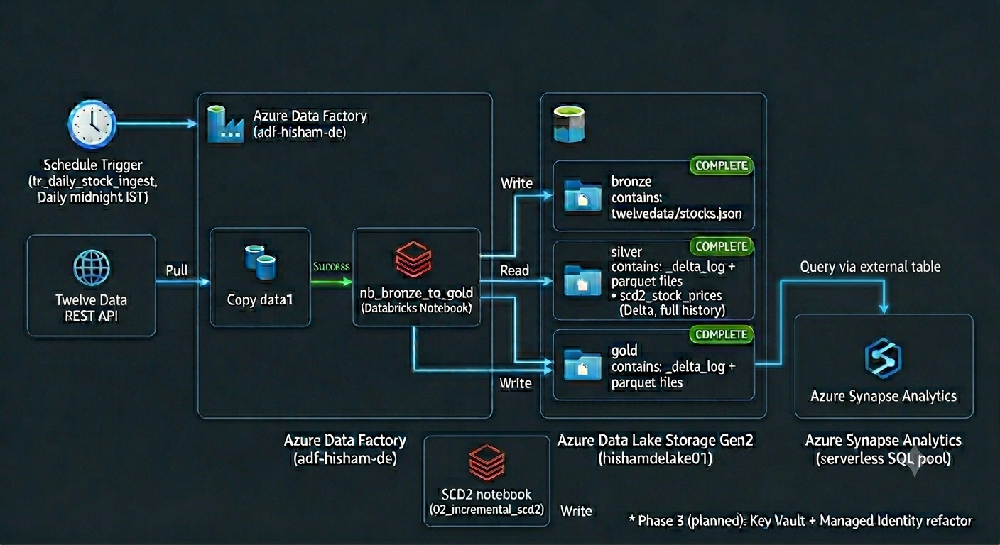

# Azure Stock Data Pipeline

An automated, production-grade financial batch data pipeline built on Azure, demonstrating the full modern data engineering stack.

## Architecture

## What This Pipeline Does

1. **Ingest:** Azure Data Factory pulls daily OHLCV stock data (AAPL, MSFT, GOOGL, TSLA, NVDA, AMZN) from the Twelve Data REST API and lands raw JSON in the bronze layer
2. **Transform:** A Databricks PySpark notebook cleans, flattens, and writes the silver Delta table, then aggregates business KPIs into the gold Delta table
3. **Serve (Phase 3):** Azure Synapse Analytics serverless SQL pool will expose gold Delta tables as external tables for analyst queries

The pipeline runs automatically every day at midnight IST via a schedule trigger.

## Tech Stack

| Component | Service |
|---|---|
| Orchestration | Azure Data Factory V2 |
| Storage | Azure Data Lake Storage Gen2 (hierarchical namespace) |
| Transformation | Azure Databricks (PySpark, Delta Lake) |
| Serving | Azure Synapse Analytics serverless SQL *(Phase 3)* |
| Data Source | Twelve Data REST API |

## Medallion Architecture
